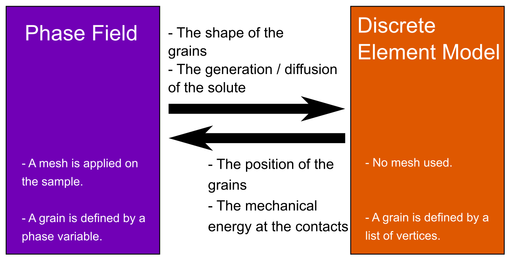

# PFDEM_ACS_Shear

Phase-Field Discrete Element Modelisation with solute generation applied to granular material sheared.

## Simulation presentation
The goal is to simulate the competition between pressure-solution phenomena (illustrated by the following scheme) and the shearing speed for a granular material.

## Technical description
The PFDEM is a discussion between phase-field (PF) simulation and discrete element modelization (DEM). Even if those formulations are different, they can collaborate with data exchange.

The [phase-field theory](https://en.wikipedia.org/wiki/Phase-field_model) is based on the mesh of the sample and grains are represented by a phase variable (= 1 if the node is a grain, = 0 else). This formulation transmit to the DEM the shape of the grain. Hence, a grain detection algorithm is used to extract the shape from the phase field. In this case, no information about the solute is needed as it is assumed the solute is instantaneously evacuated.

The [discrete element model](https://en.wikipedia.org/wiki/Discrete_element_method) does not need mesh and grains are represented by a list of vertices (here polygonal grains are assumed). The role of the DEM is to compute the position of the grains. Then, an algorithm is used to convert the grain position in a new phase-field. The mechanical energy at the contact level is not considered as the acid is the motor term of the dissolution.

A back and forth is done between phase-field (PF) simulation and discrete element modelisation (DEM). The shape of the grains changes with phase-field and the grain motion is computed with DEM step.

Phase-field approach is computed with [MOOSE](https://github.com/idaholab/moose) (the solver must be correctly installed) and DEM is computed with an own script based on python 3.9.6. The launch of this project is done by executing the python script <i>main.py</i> (multiple run can be asked with <i>multiple_main.py</i>). The user can change variables inside the python script <i>User.py</i>. A section in the following helps to understand the different inputs.

Saves are done before the phase-field simulation and at the end of the DEM. If crash (it seems to happend sometimes during the phase-field simulation with MOOSE) occurs during the simulation, the function <i>main_after_crash.py</i> can be called to come back before the crash.

A [documentation](https://alexsacmorane.github.io/pfdem_acs_shear) for the python script is available.

### Phase-field
The goal of the phase-field step is to compute the shape of the grains as it evolves with the precipitation/dissolution.
An Allen-Cahn formulation is used coupled with a solute generation and diffusion. Hence, the conservation of the mass should be verified as precipitation/dissolution occurs.

### DEM
The goal of the DEM step is to compute the grain motion. Grains are assumed as polygonal. The shape is computed from an interpolation of the phase variable.

## What is next ?
Some next releases are presented here.

- update doc on the website
- increase the user experience (homogenize names, correct english)
- publish an article about the simulation and result

## Understand User.py

description in progress...
